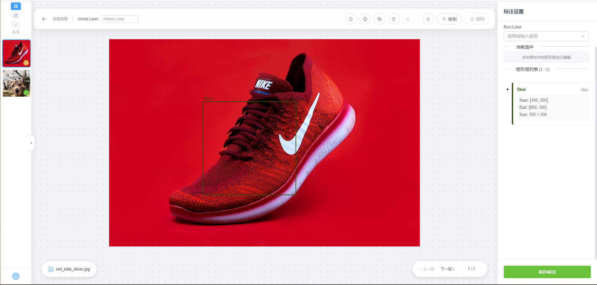
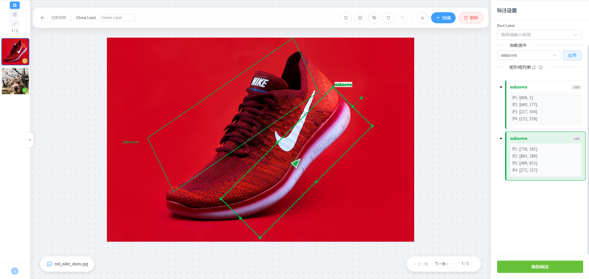
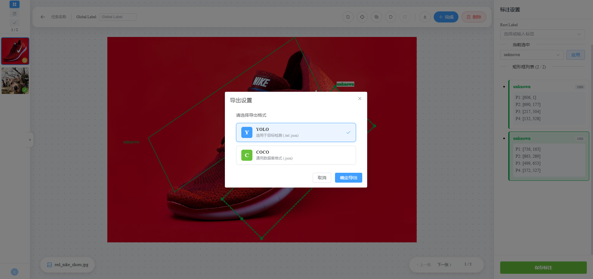

# Vue Fabric Annotator 🎨

[](https://vuejs.org/)
[](https://www.typescriptlang.org/)
[](http://fabricjs.com/)
[](https://element-plus.org/)
[](./LICENSE)

**Vue Fabric Annotator** 是一款基于 Web 的专业级图像标注工具。它专为计算机视觉任务（如目标检测）设计，支持 **水平矩形 (AABB)** 和 **旋转矩形 (OBB)** 的高精度标注。

本项目利用 `Vue 3 (Composition API)` 的响应式特性结合 `Fabric.js` 强大的 Canvas 渲染能力，解决了传统 Web 标注工具在处理复杂几何变换、历史记录回溯及大数据量渲染时的性能瓶颈。



---

## ✨ 核心特性 (Features)

*   **多模式标注**：
    *   🟥 **AABB (Axis-Aligned Bounding Box)**：标准的水平矩形标注。
    *   🔄 **OBB (Oriented Bounding Box)**：支持任意角度旋转的矩形，适用于斜向物体检测。
    *   🎯 **智能拟合**：支持"紧贴模式 (Tight)"与"正向模式 (Axis)"切换，自动计算最小外接矩形。
*   **强大的交互体验**：
    *   🖱️ **平滑缩放与平移**：基于鼠标位置的中心缩放，支持中键/Alt+拖拽平移。
    *   ⌨️ **全键盘快捷键**：支持 WASD 微调尺寸、方向键移动、R/E 旋转等高效操作。
    *   ↩️ **历史记录系统**：内置 Undo/Redo 栈，支持撤销/重做任意操作（包括移动、缩放、删除、修改标签）。
*   **数据管理**：
    *   🏷️ **标签系统**：支持动态创建标签、颜色自动生成、标签筛选与批量修改。
    *   📂 **批量操作**：支持多选、批量删除、批量下载。
    *   💾 **导出格式**：一键导出 **YOLO** 或 **COCO** 格式数据集。
*   **高级功能**：
    *   📋 **剪贴板支持**：跨图片复制/粘贴标注框（保留尺寸与角度）。
    *   🧩 **组合操作**：支持多选编组（Group）后的整体移动与缩放。
    *   📏 **智能辅助**：自动显示方向指示器、智能标签避让算法（防止标签文字遮挡关键区域）。

---

## 🚀 技术亮点与难点突破 (Technical Highlights)

本项目在开发过程中攻克了多个前端图形处理的技术难点：

### 1. 复杂几何变换的数学计算
Canvas 中的对象变换（缩放、旋转、倾斜）会改变坐标系。本项目实现了：
*   **OBB 坐标还原**：通过 `QR分解` 矩阵变换，从 Fabric.js 的变换矩阵中精确提取旋转角度和原始尺寸。
*   **几何点计算**：实现了 `getGeometricPoints` 算法，能够根据中心点、宽高和旋转角度，反算出四个顶点的精确坐标，确保后端模型训练数据的准确性。

### 2. 响应式与 Canvas 的状态同步
*   **双向绑定**：解决了 Vue 的响应式数据（左侧列表、选中状态）与 Fabric.js Canvas 对象状态的实时同步问题。
*   **无损历史记录**：设计了自定义的 `History Stack`，在进行撤销/重做时，不仅仅是简单的快照恢复，而是通过 `syncCanvasStateForHistory` 保持了对象的唯一 ID 和关联关系，防止状态丢失。

### 3. 高性能渲染与交互优化
*   **渲染优化**：利用 `requestAnimationFrame` 和防抖 (`Debounce`) 处理高频的 `object:modified` 事件，在大数据量（单图上百个框）下依然保持流畅。
*   **智能 UI 避让**：实现了 `getSafeLabelPosition` 算法，动态计算 Label 文字的位置，确保在画布边缘、框体内部或外部都能清晰显示，互不遮挡。

---

## 🛠️ 安装与运行 (Installation)

确保你的环境已安装 Node.js (v16+) 和 npm/pnpm。

```bash
# 1. 克隆项目
git clone https://github.com/your-username/vue-fabric-annotator.git
cd vue-fabric-annotator

# 2. 安装依赖
npm install
# 或者
pnpm install

# 3. 启动开发服务器
npm run dev
```

---

## 📖 使用指南 (User Guide)

### 1. 基础操作
*   **绘制**：点击顶部工具栏的 **"绘制"** (或按 `P` / 点击图标)，在画布上拖拽即可创建矩形。
*   **选择**：点击任意矩形框选中；按住 `Shift` + 点击可多选；在空白处拖拽可框选多个对象。
*   **编辑**：选中框后，拖拽控制点可缩放；拖拽旋转控制点（MTR）可旋转。

### 2. 快捷键列表 (Shortcuts)

为了提高标注效率，建议熟练使用以下快捷键：

| 功能分类 | 按键操作 | 描述 |
| :--- | :--- | :--- |
| **视图控制** | `Alt` + 拖拽 / `中键` | 平移画布 |
| | `Ctrl` + 滚轮 | 缩放画布 |
| | `Ctrl` + `滚轮点击` | 复位视图 |
| **通用编辑** | `Ctrl` + `Z` | 撤销 (Undo) |
| | `Ctrl` + `Shift` + `Z` / `Ctrl` + `Y` | 重做 (Redo) |
| | `Del` / `Backspace` | 删除选中对象 |
| | `Ctrl` + `C` / `V` | 复制 / 粘贴 |
| **移动与微调** | `↑` `↓` `←` `→` | 移动 1px |
| | `Shift` + `↑`... | 快速移动 10px |
| **变换操作** | `R` / `E` | 顺/逆时针旋转 15° |
| | `Shift` + `R` / `E` | 精细旋转 1° |
| | `+` / `-` | 整体放大/缩小 |
| | `W` / `S` | 调整高度 (Shift 加速) |
| | `A` / `D` | 调整宽度 (Shift 加速) |
| **系统** | `H` / `?` | 打开快捷键帮助 |

---

## 📸 界面展示 (Screenshots)

### OBB 旋转标注与方向指示


### 批量导出与格式选择


---

## 🤝 贡献 (Contribution)

欢迎提交 Issue 或 Pull Request！

1.  Fork 本仓库
2.  新建 Feat_xxx 分支
3.  提交代码
4.  新建 Pull Request

---

## 📄 许可证 (License)

本项目采用 [MIT License](LICENSE) 开源。

---

> Created with ❤️ by [Nuaawly]
